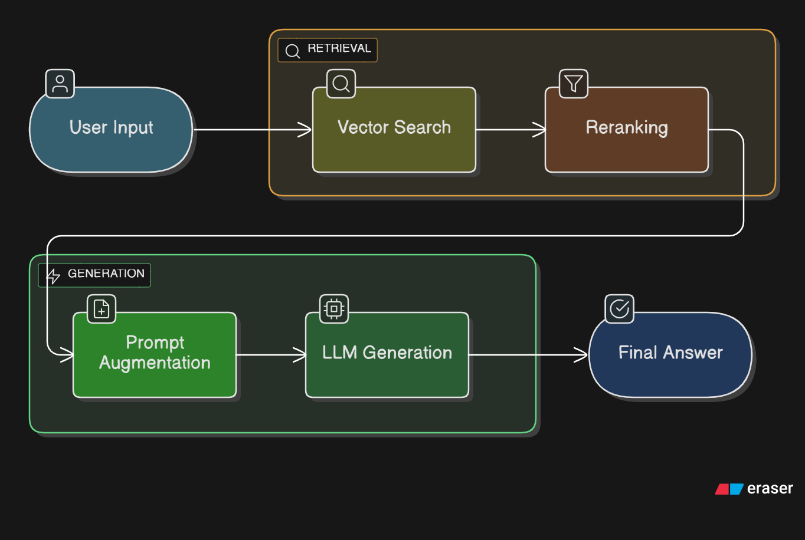
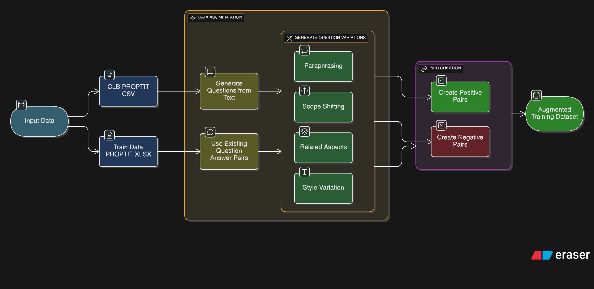
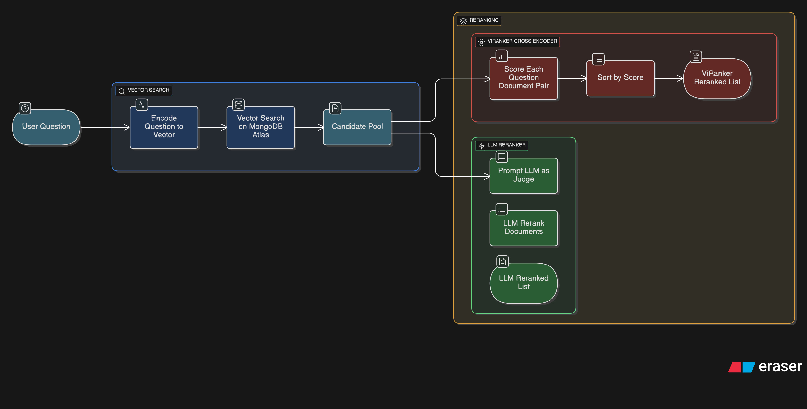

# Hệ thống RAG cho Chatbot CLB Lập trình PTIT (PROPTIT)

Tài liệu này mô tả chi tiết kiến trúc và các thành phần của hệ thống Retrieval-Augmented Generation (RAG) được xây dựng để trả lời các câu hỏi liên quan đến CLB Lập trình PTIT.

## Mục lục
- [Hệ thống RAG cho Chatbot CLB Lập trình PTIT (PROPTIT)](#hệ-thống-rag-cho-chatbot-clb-lập-trình-ptit-proptit)
  - [Mục lục](#mục-lục)
  - [1. Tổng quan kiến trúc](#1-tổng-quan-kiến-trúc)
  - [2. Data Pipeline - Tăng cường và Chuẩn bị dữ liệu](#2-data-pipeline---tăng-cường-và-chuẩn-bị-dữ-liệu)
  - [3. Indexing Pipeline - Lập chỉ mục dữ liệu](#3-indexing-pipeline---lập-chỉ-mục-dữ-liệu)
  - [4. Retrieval \& Reranking Pipeline - Truy xuất và Sắp xếp lại](#4-retrieval--reranking-pipeline---truy-xuất-và-sắp-xếp-lại)
    - [4.1. Vector Search](#41-vector-search)
    - [4.2. Reranking](#42-reranking)
  - [5. Generation Pipeline - Sinh câu trả lời](#5-generation-pipeline---sinh-câu-trả-lời)
  - [6. Các Model được sử dụng](#6-các-model-được-sử-dụng)
  - [7. Benchmark và Đánh giá](#7-benchmark-và-đánh-giá)
    - [Bảng điểm Retrieval Metrics](#bảng-điểm-retrieval-metrics)
      - [Kết quả trên tập Train](#kết-quả-trên-tập-train)
      - [Kết quả trên tập Test](#kết-quả-trên-tập-test)
    - [Bảng điểm Generation Metrics](#bảng-điểm-generation-metrics)
      - [Kết quả trên tập Train](#kết-quả-trên-tập-train-1)
      - [Kết quả trên tập Test](#kết-quả-trên-tập-test-1)

---

## 1. Tổng quan kiến trúc

Hệ thống RAG được thiết kế theo một kiến trúc module, bao gồm các giai đoạn chính: **Data Augmentation**, **Indexing**, **Retrieval**, **Reranking**, và **Generation**. Mục tiêu là cung cấp câu trả lời chính xác, phù hợp và dựa trên nguồn kiến thức tin cậy về CLB PROPTIT.

*Sơ đồ tổng quan kiến trúc hệ thống RAG cho CLB PROPTIT*

Sơ đồ luồng xử lý một câu hỏi của người dùng:
1.  **Query Input**: Người dùng nhập câu hỏi.
2.  **Retrieval Stage**:
    *   **Vector Search**: Tìm kiếm ngữ nghĩa (Vector Search) để lấy ra một tập lớn các tài liệu ứng viên (candidate documents).
    *   **Reranking**: Một model chuyên biệt (Cross-Encoder) hoặc một LLM sẽ đánh giá và sắp xếp lại các tài liệu ứng viên dựa trên mức độ liên quan với câu hỏi. `k=7` tài liệu liên quan nhất được chọn.
3.  **Generation Stage**:
    *   **Prompt Augmentation**: Câu hỏi gốc của người dùng và `k=7` tài liệu đã được sắp xếp lại được kết hợp thành một prompt hoàn chỉnh.
    *   **LLM Generation**: Prompt được đưa vào một Large Language Model (LLM) mạnh mẽ để sinh ra câu trả lời cuối cùng.

---

## 2. Data Pipeline - Tăng cường và Chuẩn bị dữ liệu

Chất lượng của hệ thống RAG phụ thuộc rất lớn vào chất lượng dữ liệu huấn luyện. Để giải quyết vấn đề thiếu hụt dữ liệu và tăng cường hiệu suất cho các model Embedding và Reranker, một pipeline tăng cường dữ liệu (Data Augmentation) bằng LLM đã được xây dựng.

*Sơ đồ quy trình tăng cường và chuẩn bị dữ liệu*

**Nguồn dữ liệu gốc:**
*   `CLB_PROPTIT.csv`: Chứa các văn bản gốc về thông tin của CLB.
*   `train_data_proptit.xlsx`: Chứa dữ liệu huấn luyện gồm các cột: `Query` (câu hỏi), `Ground truth document` (văn bản đúng) và `Ground truth answer` (câu trả lời đúng).

**Quy trình tăng cường:**
1.  **Tạo câu hỏi từ văn bản**: Với mỗi văn bản trong `CLB_PROPTIT.csv`, sử dụng LLM (`meta/llama-3.1-405b-instruct`) để tạo ra các câu hỏi đa dạng (dễ, trung bình, khó) mà văn bản đó có thể trả lời.
2.  **Tạo biến thể câu hỏi**: Với mỗi câu hỏi (cả từ `train_data_proptit.xlsx` và từ bước 1), sử dụng LLM để tạo ra các biến thể (variations) bằng nhiều kỹ thuật:
    *   **Paraphrasing**: Diễn đạt lại bằng từ đồng nghĩa, cấu trúc khác.
    *   **Scope Shifting**: Thay đổi phạm vi câu hỏi (mở rộng, thu hẹp).
    *   **Related Aspects**: Hỏi về các khía cạnh liên quan.
    *   **Style Variation**: Thay đổi văn phong (câu hỏi đầy đủ, cụm từ khóa tìm kiếm).
3.  **Tạo cặp dữ liệu (Query, Positive/Negative Documents)**:
    *   **Positive Pairs**: Mỗi câu hỏi/biến thể được ghép với văn bản gốc liên quan.
    *   **Negative Pairs**: Để giúp model phân biệt tốt hơn, các cặp "negative" được tạo ra bằng cách ghép một câu hỏi với một văn bản hoàn toàn không liên quan một cách ngẫu nhiên.

Kết quả của pipeline này là một bộ dữ liệu huấn luyện lớn và chất lượng cao (`reranker_training_data.jsonl`) dùng để fine-tune các model Embedding và Reranker.

---

## 3. Indexing Pipeline - Lập chỉ mục dữ liệu

Giai đoạn này chuyển đổi các tài liệu văn bản thành các vector và lưu trữ chúng để có thể truy xuất hiệu quả.

1.  **Embedding Model**: Sử dụng model **`iwillcthew/vietnamese-embedding-PROPTIT-domain-ft`**. Đây là phiên bản đã được fine-tune từ model gốc `AITeamVN/Vietnamese_Embedding_v2` trên bộ dữ liệu tăng cường.
2.  **Vectorization**: Mỗi văn bản trong `CLB_PROPTIT.csv` được đưa qua Embedding Model để tạo ra một vector embedding đại diện cho ngữ nghĩa của nó.
3.  **Storage**: Các vector embedding cùng với metadata (ID, nội dung gốc) được lưu trữ và lập chỉ mục trong **MongoDB Atlas Vector Search**.

---

## 4. Retrieval & Reranking Pipeline - Truy xuất và Sắp xếp lại

Đây là trái tim của hệ thống RAG, chịu trách nhiệm tìm ra những thông tin liên quan nhất từ kho kiến thức.

*Sơ đồ quy trình truy xuất và sắp xếp lại tài liệu*

### 4.1. Vector Search

Hệ thống sử dụng tìm kiếm ngữ nghĩa (semantic search) thuần túy để truy xuất thông tin một cách hiệu quả.

1.  **Semantic Search**: Câu hỏi của người dùng được mã hóa thành vector bằng cùng một Embedding Model đã được fine-tune. Sau đó, thực hiện tìm kiếm vector trên MongoDB Atlas để tìm ra các tài liệu có ngữ nghĩa gần nhất với câu hỏi.
2.  **Candidate Pool**: Một tập hợp lớn các tài liệu ứng viên (ví dụ: 30 tài liệu) được tạo ra từ bước này để đưa vào giai đoạn Reranking.

**Ưu điểm của Vector Search:**
- Hiểu được ngữ nghĩa sâu của câu hỏi, không chỉ dựa trên từ khóa
- Có thể tìm ra tài liệu liên quan ngay cả khi không có từ khóa chính xác
- Hiệu suất tốt với embedding model đã được fine-tune trên domain PROPTIT

### 4.2. Reranking

Giai đoạn Vector Search có thể trả về một số tài liệu không thực sự liên quan hoặc có thể sắp xếp không tối ưu. Reranking giúp lọc và sắp xếp lại các tài liệu này một cách chính xác hơn. Hệ thống đã thử nghiệm hai phương pháp:

**Phương pháp 1: ViRanker (Cross-Encoder)**
*   **Model**: Sử dụng **`iwillcthew/ViRanker-PROPTIT-domain-ft`**, một model Cross-Encoder được fine-tune từ `namdp-ptit/ViRanker`.
*   **Cơ chế**: Model này nhận đầu vào là một cặp (câu hỏi, tài liệu) và trả về một điểm số (score) thể hiện mức độ liên quan. Nó sẽ tính điểm cho tất cả các cặp (câu hỏi, tài liệu ứng viên) và sắp xếp lại theo điểm số từ cao đến thấp.
*   **Nhược điểm**: Tốn tài nguyên tính toán (yêu cầu GPU) và có hiệu suất thấp hơn LLM Reranker trên tập test thực tế.

**Phương pháp 2: LLM Reranker**
*   **Model**: Sử dụng **`meta/llama-3.1-405b-instruct`**.
*   **Cơ chế**: Xây dựng một prompt đặc biệt, yêu cầu LLM đóng vai trò là một "giám khảo" để đánh giá và sắp xếp lại danh sách các tài liệu ứng viên dựa trên câu hỏi.
*   **Ưu điểm**: Tận dụng được khả năng suy luận và hiểu ngữ cảnh sâu của LLM, cho hiệu suất tốt hơn trên tập test. Không yêu cầu GPU chuyên dụng để chạy, phù hợp với môi trường triển khai.

**Lựa chọn cuối cùng:** Do không có GPU để vận hành Cross-Encoder và kết quả benchmark trên tập test cho thấy LLM Reranker có hiệu suất cao hơn, **phương pháp LLM Reranker đã được chọn cho pipeline chính thức.**

Sau giai đoạn Reranking, chọn ra **`k=7`** tài liệu có điểm số cao nhất để đưa vào giai đoạn sinh câu trả lời.

---

## 5. Generation Pipeline - Sinh câu trả lời

1.  **Prompt Construction**: Một prompt chi tiết được tạo ra, bao gồm:
    *   **System Instruction**: Hướng dẫn LLM về vai trò, nhiệm vụ (ví dụ: "Bạn là trợ lý ảo của CLB PROPTIT, hãy trả lời câu hỏi dựa trên thông tin được cung cấp...").
    *   **Context**: Toàn bộ nội dung của `k=7` tài liệu đã được sắp xếp lại.
    *   **Question**: Câu hỏi gốc của người dùng.
2.  **LLM Generation**: Prompt hoàn chỉnh được gửi đến model **`meta/llama-3.1-405b-instruct`** thông qua NVIDIA NIM API. Model sẽ đọc, hiểu ngữ cảnh và sinh ra câu trả lời cuối cùng cho người dùng.

---

## 6. Các Model được sử dụng

| Thành phần | Model Gốc | Model Fine-tuned (trên Hugging Face) | Vai trò |
| :--- | :--- | :--- | :--- |
| **Embedding** | `AITeamVN/Vietnamese_Embedding_v2` | `iwillcthew/vietnamese-embedding-PROPTIT-domain-ft` | Mã hóa văn bản và câu hỏi thành vector |
| **Reranker** | `namdp-ptit/ViRanker` | `iwillcthew/ViRanker-PROPTIT-domain-ft` | Sắp xếp lại các tài liệu được truy xuất |
| **LLM** | `meta/llama-3.1-405b-instruct` | (Không fine-tune) | Tăng cường dữ liệu, Reranking, Sinh câu trả lời |

---

## 7. Benchmark và Đánh giá

### Bảng điểm Retrieval Metrics

#### Kết quả trên tập Train

| K | hit@k | recall@k | precision@k | f1@k | map@k | mrr@k | ndcg@k | context_precision@k | context_recall@k | context_entities_recall@k |
|---|-------|----------|-------------|------|-------|-------|--------|----------------------|------------------|---------------------------|
| 3 | 0.80  | 0.60     | 0.36        | 0.43 | 0.70  | 0.71  | 0.73   | 0.56                 | 0.45             | 0.50                      |
| 5 | 0.86  | 0.71     | 0.27        | 0.37 | 0.70  | 0.73  | 0.75   | 0.42                 | 0.34             | 0.54                      |
| 7 | 0.87  | 0.74     | 0.20        | 0.31 | 0.66  | 0.70  | 0.73   | 0.31                 | 0.27             | 0.55                      |

#### Kết quả trên tập Test

| K | hit@k | recall@k | precision@k | f1@k | map@k | mrr@k | ndcg@k | context_precision@k | context_recall@k | context_entities_recall@k |
|---|-------|----------|-------------|------|-------|-------|--------|----------------------|------------------|---------------------------|
| 3 | 0.93  | 0.75     | 0.48        | 0.55 | 0.81  | 0.82  | 0.84   | 0.70                 | 0.66             | 0.73                      |
| 5 | 0.90  | 0.78     | 0.32        | 0.42 | 0.79  | 0.81  | 0.83   | 0.50                 | 0.47             | 0.74                      |
| 7 | 0.97  | 0.84     | 0.25        | 0.36 | 0.79  | 0.82  | 0.85   | 0.39                 | 0.37             | 0.78                      |

### Bảng điểm Generation Metrics

#### Kết quả trên tập Train

| K | string_presence@k | rouge_l@k | bleu_4@k | groundedness@k | response_relevancy@k | noise_sensitivity@k |
|---|-------------------|-----------|----------|----------------|----------------------|---------------------|
| 3 | 0.40              | 0.29      | 0.07     | 0.86           | 0.83                 | 0.13                |
| 5 | 0.42              | 0.29      | 0.08     | 0.83           | 0.82                 | 0.13                |
| 7 | 0.43              | 0.29      | 0.08     | 0.84           | 0.82                 | 0.13                |

#### Kết quả trên tập Test

| K | string_presence@k | rouge_l@k | bleu_4@k | groundedness@k | response_relevancy@k | noise_sensitivity@k |
|---|-------------------|-----------|----------|----------------|----------------------|---------------------|
| 3 | 0.50              | 0.46      | 0.18     | 0.98           | 0.91                 | 0.01                |
| 5 | 0.54              | 0.48      | 0.22     | 0.99           | 0.92                 | 0.01                |
| 7 | 0.53              | 0.47      | 0.20     | 0.99           | 0.93                 | 0.00                |

